# Soigineer

<div align="center">

**Real-time log ingestion, monitoring, and incident alerting for distributed systems.**

[](https://github.com/n0thing2c/Soigineer/actions/workflows/ci.yml)
[](backend/go.mod)
[](frontend/package.json)
[](docker-compose.yml)

[Getting Started](#getting-started) · [Architecture](#architecture) · [Project Structure](#project-structure) · [API](#api-reference) · [Contributing](#contributing)

</div>

## Overview

Soigineer is an event-driven observability platform that collects application logs over HTTP, buffers them with Redpanda, processes them in batches, stores log data in ClickHouse, and streams live events to a React dashboard over WebSocket.

For `ERROR` and `CRITICAL` logs, Soigineer creates alerts, groups incidents by fingerprint, suppresses duplicate notifications with Redis, and can send alerts through Telegram. PostgreSQL stores users, access rules, applications, alert rules, refresh tokens, and incident state.

## Features

- Single and batch log ingestion over HTTP
- Asynchronous, at-least-once processing with Redpanda
- Message normalization, error classification, and incident fingerprinting
- Historical log storage in ClickHouse with a 30-day TTL
- Real-time log and alert streams over WebSocket
- Incident workflow with `OPEN`, `ACKED`, and `RESOLVED` states
- Per-application and per-level alert rules
- Redis-backed alert deduplication
- Optional Telegram notifications
- Access and refresh token authentication
- `admin` and `engineer` role-based access control
- Dashboard for live logs, incidents, health analytics, alert rules, and user access
- Built-in workload simulator and Markdown benchmark reports

## Table of Contents

- [Architecture](#architecture)
- [Project Structure](#project-structure)
- [Tech Stack](#tech-stack)
- [Getting Started](#getting-started)
- [Send Your First Log](#send-your-first-log)
- [API Reference](#api-reference)
- [Configuration](#configuration)
- [Testing and Building](#testing-and-building)
- [Load Testing](#load-testing)
- [Operations](#operations)
- [Production Checklist](#production-checklist)
- [Roadmap](#roadmap)
- [Contributing](#contributing)
- [Security](#security)
- [License](#license)

## Architecture

```mermaid
flowchart LR
    %% =========================================================
    %% External actors and services
    %% =========================================================

    Operator["Admin / Engineer"]
    Producers["External Apps"]
    Telegram(["Telegram API<br/>optional"])

    %% =========================================================
    %% User Interface
    %% =========================================================

    subgraph UI["User Interface"]
        direction TB

        subgraph uiDashboardRow[" "]
            direction LR
            uiDashboardEntry[" "]:::relay
            Dashboard["React Dashboard"]
            uiDashboardEntry --> Dashboard
        end
    end

    %% =========================================================
    %% API Services
    %% =========================================================

    subgraph API["API Services"]
        direction TB

        subgraph apiGatewayRow[" "]
            direction LR
            apiGatewayEntry[" "]:::relay
            Gateway["Ingestion Gateway<br/>HTTP :8080"]
            apiGatewayEntry --> Gateway
        end

        subgraph apiAuthRow[" "]
            direction LR
            apiAuthEntry[" "]:::relay
            Auth["Auth Service<br/>HTTP :8070"]
            apiAuthEntry --> Auth
        end

        subgraph apiMonitoringRow[" "]
            direction LR
            apiMonitoringDashboardEntry[" "]:::relay
            apiMonitoringRedpandaEntry[" "]:::relay
            Monitoring["Monitoring Service<br/>REST + WebSocket :8090"]

            apiMonitoringDashboardEntry --> Monitoring
            apiMonitoringRedpandaEntry --> Monitoring
        end
    end

    %% =========================================================
    %% Redpanda
    %% =========================================================

    Redpanda[("Redpanda<br/>Kafka-compatible<br/><br/>Topics:<br/>raw-logs<br/>processed-logs<br/>alert")]

    %% =========================================================
    %% Async Processing
    %% =========================================================

    subgraph Async["Async Processing"]
        direction TB

        subgraph asyncProcessorRow[" "]
            direction LR
            asyncProcessorEntry[" "]:::relay
            Processor["Logs Processor<br/>normalize, classify,<br/>fingerprint, batch write"]
            asyncProcessorEntry --> Processor
        end
    end

    %% =========================================================
    %% Storage
    %% =========================================================

    subgraph Storage["Storage"]
        direction TB

        subgraph storagePostgresRow[" "]
            direction LR
            postgresAuthEntry[" "]:::relay
            postgresMonitoringEntry[" "]:::relay
            Postgres[("Postgres<br/>(users, apps,<br/>alert rules, incidents)")]

            postgresAuthEntry --> Postgres
            postgresMonitoringEntry --> Postgres
        end

        subgraph storageRedisRow[" "]
            direction LR
            redisMonitoringEntry[" "]:::relay
            Redis[("Redis<br/>(alert dedup<br/>TTL keys)")]

            redisMonitoringEntry --> Redis
        end

        subgraph storageClickHouseRow[" "]
            direction LR
            clickHouseProcessorEntry[" "]:::relay
            clickHouseMonitoringEntry[" "]:::relay
            ClickHouse[("ClickHouse<br/>(logs)")]

            clickHouseProcessorEntry --> ClickHouse
            clickHouseMonitoringEntry --> ClickHouse
        end
    end

    %% =========================================================
    %% Connections
    %%
    %% Cross-group sections use an undirected segment to a hidden
    %% relay node. The visible arrow is then drawn directly into
    %% the destination component.
    %% =========================================================

    Operator --- uiDashboardEntry

    Dashboard --- apiAuthEntry
    Dashboard --- apiMonitoringDashboardEntry

    Producers --- apiGatewayEntry

    Gateway --> Redpanda

    Redpanda --- asyncProcessorEntry
    Processor --> Redpanda

    Redpanda --- apiMonitoringRedpandaEntry

    Processor --- clickHouseProcessorEntry

    Auth --- postgresAuthEntry

    Monitoring --- postgresMonitoringEntry
    Monitoring --- redisMonitoringEntry
    Monitoring --- clickHouseMonitoringEntry
    Monitoring --> Telegram

    %% =========================================================
    %% Node styles
    %% =========================================================

    classDef relay fill:transparent,stroke:transparent,color:transparent,stroke-width:0px,font-size:0px;
    classDef actor fill:#ffffff,stroke:#999999,color:#222222;
    classDef service fill:#f5f5f5,stroke:#999999,color:#222222;
    classDef datastore fill:#f5f5f5,stroke:#999999,color:#222222;
    classDef external fill:#ffffff,stroke:#999999,color:#222222;

    class Operator,Producers actor;
    class Dashboard,Gateway,Auth,Monitoring,Processor service;
    class Redpanda,Postgres,Redis,ClickHouse datastore;
    class Telegram external;

    %% =========================================================
    %% Group styles
    %% =========================================================

    style UI fill:#fffef0,stroke:#999999
    style API fill:#fffef0,stroke:#999999
    style Async fill:#fffef0,stroke:#999999
    style Storage fill:#fffef0,stroke:#999999

    %% Hide internal layout containers
    style uiDashboardRow fill:transparent,stroke:transparent
    style apiGatewayRow fill:transparent,stroke:transparent
    style apiAuthRow fill:transparent,stroke:transparent
    style apiMonitoringRow fill:transparent,stroke:transparent
    style asyncProcessorRow fill:transparent,stroke:transparent
    style storagePostgresRow fill:transparent,stroke:transparent
    style storageRedisRow fill:transparent,stroke:transparent
    style storageClickHouseRow fill:transparent,stroke:transparent
```



### Components

| Component | Responsibility |
| --- | --- |
| Ingestion Gateway | Validates payloads and publishes raw logs to Redpanda |
| Redpanda | Buffers events and decouples ingestion, processing, real-time delivery, and alerting |
| Logs Processor | Processes batches, normalizes messages, generates fingerprints, and stores logs |
| Monitoring Service | Serves REST APIs and WebSocket streams, manages incidents, and dispatches alerts |
| Auth Service | Handles login, token rotation, user management, and RBAC |
| ClickHouse | Stores append-heavy log data and serves historical queries |
| PostgreSQL | Stores users, applications, refresh tokens, alert rules, and incidents |
| Redis | Stores short-lived alert deduplication keys |
| React Dashboard | Provides the operational interface for administrators and engineers |

### Event Flow

1. An application sends one or more logs to the Ingestion Gateway.
2. The gateway validates the payload and publishes a raw event to Redpanda.
3. The Logs Processor consumes events in batches, normalizes each message, classifies it, and creates a SHA-256 fingerprint.
4. Processed logs are written to ClickHouse and published for real-time delivery.
5. `ERROR` and `CRITICAL` events are also published to the alert topic.
6. The Monitoring Service applies alert rules, records or updates an incident, deduplicates notifications with Redis, and publishes the alert to WebSocket and optionally Telegram.
7. The dashboard queries historical data through REST and receives live updates through WebSocket.

## Project Structure

```text
.
├── .github/workflows/            # Continuous integration
├── backend/
│   ├── cmd/
│   │   ├── auth/                 # Auth Service entry point
│   │   ├── gateway/              # Ingestion Gateway entry point
│   │   ├── monitoring/           # Monitoring Service entry point
│   │   ├── processor/            # Logs Processor entry point
│   │   └── simulator/            # Load generator and benchmark reporter
│   ├── deploy/                    # ClickHouse and PostgreSQL initialization
│   └── internal/
│       ├── alerting/              # Rules, deduplication, incidents, Telegram
│       ├── auth/                  # Authentication and user management
│       ├── ingestion-gateway/     # HTTP ingestion and Redpanda producer
│       ├── metadata/              # PostgreSQL connection
│       ├── monitoring/            # Query API and analytics
│       ├── processing/            # Normalize, classify, fingerprint, store
│       ├── realtime/              # WebSocket hub and consumers
│       └── shared/                # Configuration and shared domain events
├── frontend/
│   ├── client/                    # React application
│   └── public/                    # Static assets
├── report/                        # Technical report, slides, and diagrams
└── docker-compose.yml             # Local full-stack orchestration
```

## Tech Stack

| Layer | Technology |
| --- | --- |
| Backend | Go, Gin, pgx, kafka-go, go-redis, Gorilla WebSocket |
| Frontend | React 18, TypeScript, Vite, TanStack Query, Tailwind CSS |
| Event streaming | Redpanda (Kafka-compatible) |
| Log storage | ClickHouse |
| Metadata storage | PostgreSQL |
| Short-lived state | Redis |
| Packaging | Docker, Docker Compose, Nginx |
| CI | GitHub Actions |

## Getting Started

### Prerequisites

- [Git](https://git-scm.com/)
- [Docker Engine](https://docs.docker.com/engine/install/) with Docker Compose v2
- Go 1.25 or later, Node.js 22 or later, and pnpm 10 if you plan to run application services from source

### 1. Clone the repository

```bash
git clone https://github.com/n0thing2c/Soigineer.git
cd Soigineer
```

### 2. Create the environment files

Linux or macOS:

```bash
cp backend/.env.example .env
cp backend/.env.example backend/.env
```

Windows PowerShell:

```powershell
Copy-Item backend/.env.example .env
Copy-Item backend/.env.example backend/.env
```

> [!WARNING]
> Before the first startup, replace `AUTH_TOKEN_SECRET`, `BOOTSTRAP_ADMIN_PASSWORD`, `BOOTSTRAP_ENGINEER_PASSWORD`, and all database passwords in both files. Docker Compose interpolates values from the root `.env`, while services run directly from `backend` load `backend/.env`. Keep shared values synchronized. Bootstrap passwords are only written for users that do not already have a password hash.

### 3. Choose a run mode

#### Option A: Run the complete stack with Docker

This is the recommended path for trying Soigineer or running an end-to-end environment.

```bash
docker compose up -d --build
docker compose ps
```

#### Option B: Run application services from source

Use this mode when actively developing the backend or frontend. Start only the infrastructure in Docker:

```bash
docker compose up -d redpanda-broker redpanda-init clickhouse redis postgres
```

From `backend`, run each service in a separate terminal:

```bash
go run ./cmd/gateway
```

```bash
go run ./cmd/processor
```

```bash
go run ./cmd/auth
```

```bash
go run ./cmd/monitoring
```

Then start the frontend:

```bash
cd frontend
corepack enable
pnpm install --frozen-lockfile
pnpm dev
```

### 4. Open the services

After the selected stack is ready:

| Service | URL |
| --- | --- |
| Dashboard | <http://localhost:5173> |
| Ingestion Gateway | <http://localhost:8080> |
| Auth API | <http://localhost:8070> |
| Monitoring API | <http://localhost:8090> |
| Redpanda Console | <http://localhost:8081> |

### 5. Sign in

The local database is seeded with the following accounts:

| Username | Default password | Role | Scope |
| --- | --- | --- | --- |
| `admin` | `admin123` | `admin` | All applications |
| `engineer-payment` | `engineer123` | `engineer` | `payment-service`, `order-service` |

The default passwords are replaced by the configured bootstrap values during the initial startup.

### 6. Verify service health

```bash
curl http://localhost:8070/healthz
curl http://localhost:8090/healthz
```

Expected response:

```json
{"status":"ok"}
```

## Send Your First Log

### Single event

```bash
curl --request POST http://localhost:8080/v1/ingest/logs \
  --header "Content-Type: application/json" \
  --data '{
    "applicationName": "payment-service",
    "level": "ERROR",
    "message": "Payment request failed for order 12345",
    "timestamp": "2026-07-28T10:00:00Z",
    "traceId": "trace-demo-001"
  }'
```

The gateway returns `202 Accepted` after the event has been queued:

```json
{
  "status": "accepted",
  "traceId": "trace-demo-001"
}
```

### Batch

A batch may contain between 1 and 500 logs:

```bash
curl --request POST http://localhost:8080/v1/ingest/logs/batch \
  --header "Content-Type: application/json" \
  --data '{
    "logs": [
      {
        "applicationName": "payment-service",
        "level": "INFO",
        "message": "Payment request received",
        "timestamp": "2026-07-28T10:00:00Z",
        "traceId": "trace-demo-002"
      },
      {
        "applicationName": "payment-service",
        "level": "CRITICAL",
        "message": "Payment provider is unavailable",
        "timestamp": "2026-07-28T10:00:01Z",
        "traceId": "trace-demo-003"
      }
    ]
  }'
```

`level` must be one of `INFO`, `WARN`, `ERROR`, or `CRITICAL`. `timestamp` must be a valid RFC3339 or RFC3339Nano timestamp.

## API Reference

### Ingestion Gateway

Base URL: `http://localhost:8080`

| Method | Endpoint | Description | Authentication |
| --- | --- | --- | --- |
| `POST` | `/v1/ingest/logs` | Submit one log | None (not yet implemented) |
| `POST` | `/v1/ingest/logs/batch` | Submit 1–500 logs | None (not yet implemented) |

### Auth Service

Base URL: `http://localhost:8070`

| Method | Endpoint | Description | Authentication |
| --- | --- | --- | --- |
| `GET` | `/healthz` | Health check | None |
| `POST` | `/v1/auth/login` | Sign in | None |
| `POST` | `/v1/auth/refresh` | Rotate a refresh token | None |
| `POST` | `/v1/auth/logout` | Revoke a refresh token | None |
| `GET` | `/v1/auth/me` | Return the current user | Bearer token |
| `GET`, `POST` | `/v1/admin/users` | List or create users | Admin |
| `PUT` | `/v1/admin/users/:id/applications` | Replace a user's application access | Admin |
| `GET`, `POST` | `/v1/admin/applications` | List or create applications | Admin |

### Monitoring Service

Base URL: `http://localhost:8090`

| Method | Endpoint | Description | Authentication |
| --- | --- | --- | --- |
| `GET` | `/healthz` | Health check | None |
| `GET` | `/v1/me` | Return the current principal and access scope | Bearer token |
| `GET` | `/v1/applications` | List accessible applications | Bearer token |
| `GET` | `/v1/logs` | Query historical logs | Bearer token |
| `GET` | `/v1/incidents` | List incidents | Bearer token |
| `PATCH` | `/v1/incidents/:id/status` | Update an incident status | Bearer token |
| `GET` | `/v1/analytics/health` | Return per-application health analytics | Bearer token |
| `GET`, `POST` | `/v1/admin/alert-rules` | List or create alert rules | Admin |
| `PUT` | `/v1/admin/alert-rules/:id` | Update an alert rule | Admin |
| `WS` | `/v1/realtime/logs` | Stream live logs | Token query or Bearer token |
| `WS` | `/v1/realtime/alerts` | Stream live alerts | Token query or Bearer token |

### Authentication example

Request an access and refresh token:

```bash
curl --request POST http://localhost:8070/v1/auth/login \
  --header "Content-Type: application/json" \
  --data '{"username":"admin","password":"admin123"}'
```

Use the access token for protected endpoints:

```text
Authorization: Bearer <access-token>
```

Browser WebSocket clients can pass the same token as a query parameter:

```text
ws://localhost:8090/v1/realtime/logs?token=<access-token>
```

## Configuration

Local defaults are documented in [`backend/.env.example`](backend/.env.example) and [`frontend/.env.example`](frontend/.env.example).

| Category | Key variables |
| --- | --- |
| Service ports | `GATEWAY_PORT`, `AUTH_PORT`, `MONITORING_PORT`, `DASHBOARD_PORT` |
| Redpanda | `REDPANDA_EXTERNAL_PORT`, `REDPANDA_*_TOPIC` |
| ClickHouse | `CLICKHOUSE_DB`, `CLICKHOUSE_USER`, `CLICKHOUSE_PASSWORD`, `CLICKHOUSE_PORT` |
| PostgreSQL | `POSTGRES_DB`, `POSTGRES_USER`, `POSTGRES_PASSWORD`, `POSTGRES_PORT`, `POSTGRES_SSLMODE` |
| Authentication | `AUTH_TOKEN_SECRET`, `AUTH_TOKEN_TTL_MINUTES`, `AUTH_REFRESH_TOKEN_TTL_MINUTES` |
| Bootstrap users | `BOOTSTRAP_ADMIN_PASSWORD`, `BOOTSTRAP_ENGINEER_PASSWORD` |
| Alerting | `ALERT_DEDUP_PERIOD`, `TELEGRAM_BOT_TOKEN`, `TELEGRAM_CHAT_ID`, `TELEGRAM_TIMEOUT_MS` |
| Frontend | `VITE_AUTH_API_URL`, `VITE_MONITORING_API_URL` |

Telegram notifications are disabled automatically when `TELEGRAM_BOT_TOKEN` or `TELEGRAM_CHAT_ID` is empty.

## Testing and Building

### Backend

```bash
cd backend
go test -race -cover ./...
go build ./cmd/gateway
go build ./cmd/processor
go build ./cmd/auth
go build ./cmd/monitoring
```

### Frontend

```bash
cd frontend
pnpm typecheck
pnpm test
pnpm build
```

The CI workflow checks Go formatting, runs tests with the race detector, and builds the Gateway and Processor on pull requests and pushes to `main`.

## Load Testing

The simulator supports `single`, `batch`, and `mixed` workloads. It can also inspect Redpanda and ClickHouse after a run and generate a Markdown benchmark report.

The following example targets 500 logs per second for 10 seconds:

```bash
cd backend
go run ./cmd/simulator \
  --mode batch \
  --server-count 1 \
  --logs-per-sec 500 \
  --batch-size 50 \
  --duration 10s
```

List all options:

```bash
go run ./cmd/simulator -h
```

## Operations

Check service status:

```bash
docker compose ps
```

Follow application logs:

```bash
docker compose logs -f ingestion-gateway logs-processor auth-service monitoring-service
```

Restart one service:

```bash
docker compose restart monitoring-service
```

Stop the stack and preserve data:

```bash
docker compose down
```

Remove containers and all persistent volumes:

```bash
docker compose down -v
```

> [!CAUTION]
> `docker compose down -v` permanently removes local Redpanda, ClickHouse, Redis, and PostgreSQL data, including stored logs, incidents, and users.

### Troubleshooting

| Symptom | What to check |
| --- | --- |
| `.env` or `backend/.env` does not exist | Create both files from `backend/.env.example` and keep shared values synchronized |
| Gateway returns `503 QUEUE_UNAVAILABLE` | Inspect `redpanda-broker` and `redpanda-init` health and logs |
| New logs do not appear in the dashboard | Inspect `logs-processor`, `monitoring-service`, and consumer lag in Redpanda Console |
| Login fails after changing a bootstrap password | Bootstrap does not overwrite an existing password hash; for local testing, recreate the database volume after backing up any data you need |
| Telegram alerts are missing | Verify the bot token, chat ID, and the alert rule's `telegram_enabled` value |
| A host port is already in use | Change the corresponding port in the root `.env` for Compose, or in `backend/.env` when running services from source |
